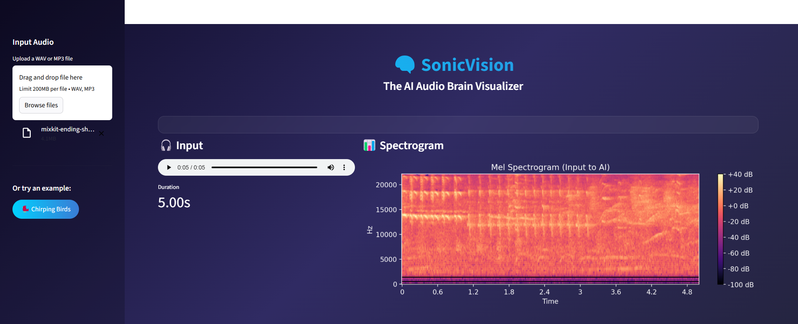
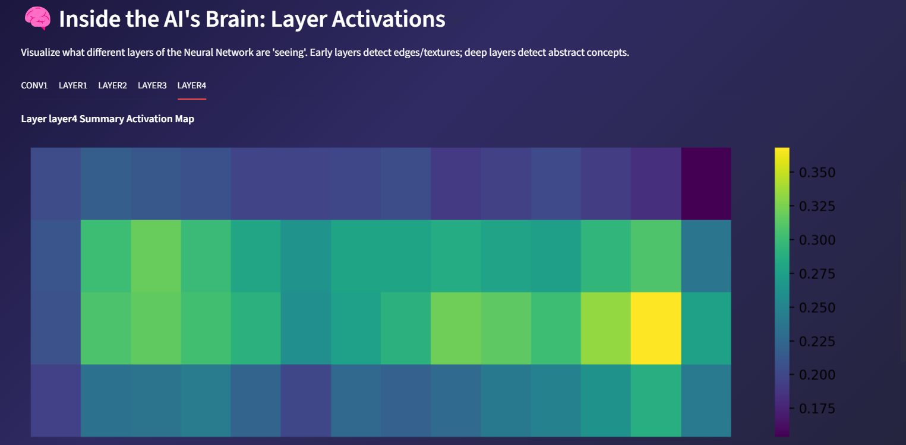
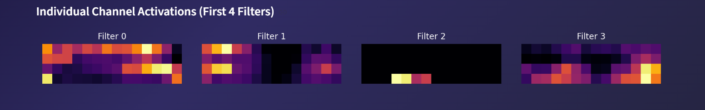

# 🧠 SonicVision: The AI Audio Brain

SonicVision is an advanced **Audio Classification Dashboard** that not only predicts sound classes but also **visualizes what the AI "sees"**. 

Using a Convolutional Neural Network (CNN) trained on Mel Spectrograms, this app peels back the "black box" layers of AI, allowing you to explore the internal feature maps of the model interactively.

## Features
- **Upload & Record**: Analyze any WAV or MP3 file.
- **Spectrogram Visualization**: See the frequency footprint of your sound.
- **Real-time Inference**: Get top-3 predictions with confidence scores.
- **Brain MRI**: Explore the activations of Conv1, Layer1, Layer2, Layer3, and Layer4 to see how the AI extracts features from edges to abstract concepts.

## Installation & Usage

1.  **Install Requirements**:
    ```bash
    pip install -r requirements.txt
    ```

2.  **Run the App**:
    ```bash
    python -m streamlit run app.py
    ```

---

## 📸 Screenshots

### 1. Home & Audio Input , Spectrogram Analysis


### 2. AI Classifications


### 3.  Activation Maps


### 4. Inside the AI's Brain (Feature Maps)

